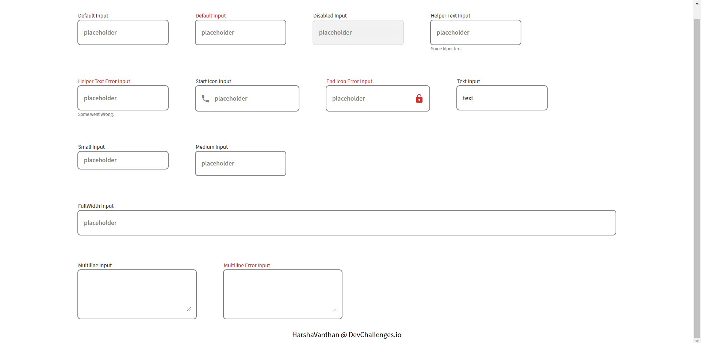

<!-- Please update value in the {}  -->

<h1 align="center">Input Component Challenge</h1>

<div align="center">
   Solution for a challenge from  <a href="http://devchallenges.io" target="_blank">Devchallenges.io</a>.
</div>

<div align="center">
  <h3>
    <a href="https://input-component.vercel.app/">
      Demo
    </a>
    <span> | </span>
    <a href="https://github.com/HarshaVardhanNakkina/input-component">
      Solution
    </a>
    <span> | </span>
    <a href="https://devchallenges.io/challenges/TSqutYM4c5WtluM7QzGp">
      Challenge
    </a>
  </h3>
</div>

<!-- TABLE OF CONTENTS -->

## Table of Contents

- [Table of Contents](#table-of-contents)
- [Overview](#overview)
  - [Built With](#built-with)
- [Features](#features)
- [How To Use](#how-to-use)
- [Acknowledgements](#acknowledgements)
- [Contact](#contact)

<!-- OVERVIEW -->

## Overview



Introduce your projects by taking a screenshot or a gif. Try to tell visitors a story about your project by answering:

- Where can I see your demo?
  - [Demo](https://input-component.vercel.app/)
- What was your experience?
  - A little bit difficult, I think. I dont know how to structure these type of components.
- What have you learned/improved?
  - CSS styles, React

### Built With

<!-- This section should list any major frameworks that you built your project using. Here are a few examples.-->

- [React](https://reactjs.org/)
- [Stitches](https://stitches.dev/)
- [Snowpack](https://www.snowpack.dev/)

## Features

<!-- List the features of your application or follow the template. Don't share the figma file here :) -->

This application/site was created as a submission to a [DevChallenges](https://devchallenges.io/challenges) challenge. The [challenge](https://devchallenges.io/challenges/TSqutYM4c5WtluM7QzGp) was to build an application to complete the given user stories.

## How To Use

<!-- Example:  -->

To clone and run this application, you'll need [Git](https://git-scm.com) and [Node.js](https://nodejs.org/en/download/) (which comes with [npm](http://npmjs.com)) installed on your computer. From your command line:

```bash
# Clone this repository
$ git clone https://github.com/HarshaVardhanNakkina/input-component

# Install dependencies
$ yarn

# Run the app
$ yarn start
```

## Acknowledgements

<!-- This section should list any articles or add-ons/plugins that helps you to complete the project. This is optional but it will help you in the future. For exmpale -->

- [Steps to replicate a design with only HTML and CSS](https://devchallenges-blogs.web.app/how-to-replicate-design/)
- [Node.js](https://nodejs.org/)
- [Marked - a markdown parser](https://github.com/chjj/marked)
- [Stitches](https://stitches.dev/)
- [Snowpack](https://www.snowpack.dev/)

## Contact

- GitHub [@HarshaVardhanNakkina](https://github.com/HarshaVardhanNakkina})
- Twitter [@Ganeshh___](https://twitter.com/Ganeshh___)
